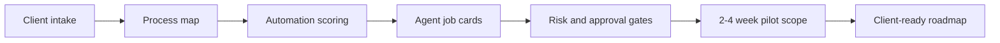

# Agentic Business Analysis

[](LICENSE)
[](SKILL.md)

A practical methodology for turning messy business operations into safe, measurable AI-agent automation pilots.

## Canonical source

This project is maintained by Aleksei Ulianov / Sprut_AI.
Original repository: https://github.com/AlekseiUL/agentic-business-analysis

If you found this project mirrored, repackaged, or redistributed elsewhere, check this repository as the source of truth.

## Attribution

Where permitted by the applicable license, if you reuse, fork, modify, package, or publish this work, keep the original copyright and license notice and link back to the canonical repository.

**Tagline:** map the business first, then design the agents.

Most AI automation projects fail because they start with a bot idea instead of an operating map. Agentic Business Analysis is a lightweight consulting toolkit for discovering where AI agents can actually help: intake, qualification, CRM hygiene, support triage, reporting, document drafting, knowledge-base operations, and controlled multi-agent workflows.

---

## Operating flow



## What this is

This repository packages a repeatable method for:

- mapping business processes into lanes, owners, inputs, outputs, tools, and bottlenecks;
- scoring automation opportunities before building anything;
- designing agent roles by responsibility, not by employee replacement;
- defining human approval gates for money, legal, public, client-facing, and destructive actions;
- converting the analysis into a 2-4 week paid pilot scope;
- producing a client-readable audit report or implementation roadmap.

It is not a framework, SaaS, or magic agent builder. It is the analysis layer that should happen before implementation.

## Who it is for

- AI automation consultants
- business analysts working with AI agents
- founders scoping internal automation
- agencies packaging AI implementation offers
- product teams designing agent-assisted operations
- operators who need a clear pilot before touching CRM, messengers, workflows, or code

## Key features

- **Client intake** — short and deep question sets for business discovery.
- **Process decomposition** — operating lanes, triggers, inputs, outputs, owners, and bottlenecks.
- **Automation scoring** — a 45-point matrix for choosing what to automate first.
- **Agent job cards** — responsibility, permissions, tools, memory, outputs, handoffs, risks, and owner.
- **Topology patterns** — single assistant, pipeline, supervisor-worker, fan-out/fan-in, workflow engine + agents, human-in-the-loop.
- **Client audit template** — a clear report structure for presenting findings.
- **Privacy and safety checklist** — data minimization, approval gates, and unsafe automation boundaries.

## Installation

### Hermes Agent — full multi-file skill

Recommended after this repository is published:

```bash
hermes skills install AlekseiUL/agentic-business-analysis/agentic-business-analysis
```

This installs the full skill directory with `SKILL.md`, `references/`, and `templates/`.

### Hermes Agent — single-file fallback

If you only want the core playbook:

```bash
hermes skills install https://raw.githubusercontent.com/AlekseiUL/agentic-business-analysis/main/SKILL.md
```

This installs only the main skill file. It works, but the full directory install is better because it includes reference files and templates.

### Manual install

```bash
git clone https://github.com/AlekseiUL/agentic-business-analysis.git
mkdir -p ~/.hermes/skills/agentic-business-analysis
cp -R agentic-business-analysis/agentic-business-analysis/* ~/.hermes/skills/agentic-business-analysis/
```

No runtime dependencies are required. The package is Markdown-only: no Python, Node, package manager, API key, database, or external service is required to install the skill. CRM/API/workflow tools mentioned in examples are implementation-specific, not repository dependencies.

## Quick start

1. Send the client the short intake from [`docs/intake-form.md`](docs/intake-form.md).
2. Map each important process with [`templates/process-map-card.md`](templates/process-map-card.md).
3. Score candidate automations with [`docs/automation-scoring.md`](docs/automation-scoring.md).
4. Pick one first pilot using this rule:

```text
Good pilot = high pain + frequent process + available data + controlled risk + visible result in 2-4 weeks.
Bad pilot = impressive demo + no owner + no data + unclear metric + high blast radius.
```

5. Design agent responsibilities with [`templates/agent-job-card.md`](templates/agent-job-card.md).
6. Package the result with [`docs/audit-report-template.md`](docs/audit-report-template.md).

## Example workflow

```text
Client business -> intake -> process map -> opportunity scoring -> first pilot -> agent job cards -> audit report -> implementation scope
```

A typical first pilot might look like this:

```text
Telegram/site form -> Intake Agent -> CRM update draft -> Manager approval -> CRM update + follow-up reminder -> Daily report
```

See [`examples/mini-audit.md`](examples/mini-audit.md) for a compact example.

## Repository contents

- [`SKILL.md`](SKILL.md) — single-file portable playbook.
- [`agentic-business-analysis/`](agentic-business-analysis/) — installable Hermes multi-file skill package.
- [`docs/intake-form.md`](docs/intake-form.md) — client discovery questions.
- [`docs/automation-scoring.md`](docs/automation-scoring.md) — opportunity scoring matrix.
- [`docs/audit-report-template.md`](docs/audit-report-template.md) — client-facing audit/report structure.
- [`docs/example-patterns.md`](docs/example-patterns.md) — common automation patterns by business type.
- [`docs/privacy-and-safety.md`](docs/privacy-and-safety.md) — privacy, data minimization, and approval gates.
- [`templates/process-map-card.md`](templates/process-map-card.md) — process mapping card.
- [`templates/opportunity-card.md`](templates/opportunity-card.md) — quick scoring card.
- [`templates/agent-job-card.md`](templates/agent-job-card.md) — agent responsibility card.
- [`examples/mini-audit.md`](examples/mini-audit.md) — compact example output.

## Core method

### 1. Business snapshot

Capture the business model, customer segments, core value chain, team roles, current tools, source of truth, and repeated weekly processes.

### 2. Process map

Split operations into lanes:

- lead generation / marketing;
- sales / qualification / CRM;
- delivery / operations / production;
- support / customer success;
- admin / documents / finance;
- reporting / management control;
- knowledge base / onboarding / SOPs.

### 3. Opportunity scoring

Score each opportunity across business pain, frequency, repeatability, data availability, integration ease, human approval fit, risk, pilot visibility, and commercial value.

### 4. Agent contour

Design agents by operational responsibility, not by employee replacement.

Useful agent roles include Intake Agent, Qualification Agent, CRM Hygiene Agent, Support Triage Agent, Knowledge Base Agent, Document Agent, Reporting Agent, Content Ops Agent, Quality Check Agent, and Coordinator/Supervisor Agent.

### 5. Pilot scope

The first implementation should be narrow:

- one business lane;
- one measurable pain;
- one clear human owner;
- one approval model;
- visible effect in 2-4 weeks.

## Safety, privacy, and non-goals

Use sober language. This is not “AI magic” and not employee replacement.

Good framing:

> We identify repeated operational work where AI agents can structure information, draft outputs, update systems, detect gaps, and escalate decisions to humans.

Avoid:

> Fully autonomous AI employees will run your company.

Do not automate first:

- autonomous deal closing with discounts or promises;
- legal, medical, or financial advice to clients;
- public publishing without approval;
- destructive admin actions;
- full ERP/accounting migration;
- “replace the CEO” fantasies;
- processes with no owner and no source data.

Before using real client data, read [`docs/privacy-and-safety.md`](docs/privacy-and-safety.md).

## Status / roadmap

Current status: **v1.0-ready methodology package**.

Possible next improvements:

- more industry-specific examples;
- ready-made PDF/report layout;
- scoring spreadsheet;
- implementation handoff templates for n8n, LangGraph, Hermes Agent, or custom CRM integrations.

## Contributing

Contributions are welcome if they improve practical business analysis, safer agent design, or clearer pilot scoping.

Please see [`CONTRIBUTING.md`](CONTRIBUTING.md) and [`SECURITY.md`](SECURITY.md).

## Links / Resources

- YouTube: https://youtube.com/@alekseiulianov
- Telegram channel Sprut AI: https://t.me/Sprut_AI
- Telegram chat: https://t.me/+eH-qNIDmud8zNDZi
- AI Операционка: https://t.me/tribute/app?startapp=sJyg

## License

MIT. See [`LICENSE`](LICENSE).

---

# Агентная бизнес-аналитика

Практическая методология для превращения хаотичной бизнес-операционки в безопасные и измеримые пилоты внедрения AI-агентов.

**Коротко:** сначала карта бизнеса, потом агенты.

Большинство проектов AI-автоматизации ломаются не из-за модели, а из-за плохого входа: начинают с идеи “давайте сделаем бота”, хотя сначала нужно понять процессы, владельцев, данные, инструменты, риски и точки согласования. Agentic Business Analysis помогает найти, где агенты реально полезны: обработка входящих заявок, квалификация, CRM-гигиена, поддержка, отчёты, документы, база знаний и контролируемые multi-agent workflows.

## Что это

Репозиторий упаковывает повторяемый метод для:

- декомпозиции бизнес-процессов на направления, владельцев, входы, выходы, инструменты и узкие места;
- оценки, что автоматизировать первым;
- проектирования ролей агентов по ответственности, а не по “замене сотрудников”;
- фиксации human approval gates для денег, юридических/formal claims, публикаций, сообщений клиентам и разрушительных действий;
- превращения анализа в 2-4-недельный paid pilot;
- подготовки понятного клиентского аудита или roadmap внедрения.

Это не SaaS и не фреймворк. Это аналитический слой перед внедрением.

## Для кого

- консультанты по AI-автоматизации;
- бизнес-аналитики, работающие с AI-агентами;
- основатели, которые хотят внедрять агентов внутрь бизнеса;
- агентства, упаковывающие AI implementation offers;
- продуктовые команды, проектирующие agent-assisted operations;
- операторы, которым нужен нормальный пилот до подключения CRM, мессенджеров, workflow или кода.

## Что внутри

- **Client intake** — короткий и глубокий набор вопросов для клиента.
- **Process decomposition** — направления, триггеры, входы, выходы, владельцы, узкие места.
- **Automation scoring** — матрица на 45 баллов для выбора первого пилота.
- **Agent job cards** — ответственность, permissions, tools, memory, outputs, handoffs, risks, owner.
- **Topology patterns** — single assistant, pipeline, supervisor-worker, fan-out/fan-in, workflow engine + agents, human-in-the-loop.
- **Client audit template** — структура клиентского отчёта.
- **Privacy and safety checklist** — минимизация данных, approval gates и границы опасной автономии.

## Установка

### Hermes Agent — полный multi-file skill

После публикации репозитория:

```bash
hermes skills install AlekseiUL/agentic-business-analysis/agentic-business-analysis
```

Эта команда устанавливает полный skill с `SKILL.md`, `references/` и `templates/`.

### Hermes Agent — fallback одним файлом

Если нужен только основной playbook:

```bash
hermes skills install https://raw.githubusercontent.com/AlekseiUL/agentic-business-analysis/main/SKILL.md
```

Так установится только главный файл. Работает, но полный вариант лучше: там есть references и templates.

### Ручная установка

```bash
git clone https://github.com/AlekseiUL/agentic-business-analysis.git
mkdir -p ~/.hermes/skills/agentic-business-analysis
cp -R agentic-business-analysis/agentic-business-analysis/* ~/.hermes/skills/agentic-business-analysis/
```

Зависимостей нет. Это Markdown-only пакет: без Python, Node, package manager, API key, database или внешнего сервиса. CRM/API/workflow-инструменты в примерах — это детали внедрения, не зависимости репозитория.

## Быстрый старт

1. Отправьте клиенту short intake из [`docs/intake-form.md`](docs/intake-form.md).
2. Опишите важные процессы через [`templates/process-map-card.md`](templates/process-map-card.md).
3. Оцените кандидатов на автоматизацию через [`docs/automation-scoring.md`](docs/automation-scoring.md).
4. Выберите первый пилот по правилу:

```text
Хороший пилот = сильная боль + частый процесс + доступные данные + контролируемый риск + видимый результат за 2-4 недели.
Плохой пилот = эффектная демка + нет владельца + нет данных + непонятная метрика + высокий blast radius.
```

5. Опишите роли агентов через [`templates/agent-job-card.md`](templates/agent-job-card.md).
6. Упакуйте результат через [`docs/audit-report-template.md`](docs/audit-report-template.md).

## Пример процесса

```text
Бизнес клиента -> intake -> карта процессов -> scoring -> первый пилот -> job cards агентов -> аудит -> scope внедрения
```

Пример первого пилота:

```text
Telegram/site form -> Intake Agent -> CRM update draft -> Manager approval -> CRM update + follow-up reminder -> Daily report
```

Компактный пример есть в [`examples/mini-audit.md`](examples/mini-audit.md).

## Содержимое репозитория

- [`SKILL.md`](SKILL.md) — portable playbook одним файлом.
- [`agentic-business-analysis/`](agentic-business-analysis/) — installable Hermes multi-file skill.
- [`docs/intake-form.md`](docs/intake-form.md) — вопросы клиенту.
- [`docs/automation-scoring.md`](docs/automation-scoring.md) — матрица оценки автоматизации.
- [`docs/audit-report-template.md`](docs/audit-report-template.md) — структура клиентского отчёта.
- [`docs/example-patterns.md`](docs/example-patterns.md) — паттерны по типам бизнеса.
- [`docs/privacy-and-safety.md`](docs/privacy-and-safety.md) — privacy, data minimization, approval gates.
- [`templates/process-map-card.md`](templates/process-map-card.md) — карточка процесса.
- [`templates/opportunity-card.md`](templates/opportunity-card.md) — карточка возможности.
- [`templates/agent-job-card.md`](templates/agent-job-card.md) — карточка агента.
- [`examples/mini-audit.md`](examples/mini-audit.md) — компактный пример результата.

## Основной метод

### 1. Business snapshot

Фиксируем бизнес-модель, сегменты клиентов, value chain, роли команды, текущие инструменты, source of truth и повторяющиеся процессы.

### 2. Карта процессов

Делим операционку на направления:

- лидогенерация / маркетинг;
- продажи / квалификация / CRM;
- delivery / operations / production;
- поддержка / customer success;
- admin / документы / финансы;
- отчётность / управленческий контроль;
- база знаний / onboarding / SOPs.

### 3. Оценка возможностей

Оцениваем каждую возможность по боли, частоте, повторяемости, доступности данных, простоте интеграции, удобству approval, риску, видимости пилота и коммерческой ценности.

### 4. Контур агентов

Проектируем агентов по операционной ответственности, а не по “замене человека”.

Типовые роли: Intake Agent, Qualification Agent, CRM Hygiene Agent, Support Triage Agent, Knowledge Base Agent, Document Agent, Reporting Agent, Content Ops Agent, Quality Check Agent, Coordinator/Supervisor Agent.

### 5. Scope пилота

Первое внедрение должно быть узким:

- одно направление бизнеса;
- одна измеримая боль;
- один понятный human owner;
- одна approval-модель;
- видимый эффект за 2-4 недели.

## Safety, privacy и non-goals

Формулировки должны быть трезвыми. Это не “AI magic” и не замена сотрудников.

Хорошая рамка:

> Мы ищем повторяющуюся операционную работу, где AI-агенты могут структурировать информацию, готовить черновики, обновлять системы, находить пробелы и эскалировать решения человеку.

Плохая рамка:

> Полностью автономные AI-сотрудники будут управлять компанией.

Не автоматизируем первым:

- самостоятельное закрытие сделок со скидками и обещаниями;
- юридические, медицинские или финансовые советы клиентам;
- публичные публикации без approval;
- разрушительные admin-действия;
- полную миграцию ERP/accounting;
- фантазии про “замену CEO”;
- процессы без владельца и source data.

Перед использованием реальных клиентских данных читайте [`docs/privacy-and-safety.md`](docs/privacy-and-safety.md).

## Статус / roadmap

Текущий статус: **v1.0-ready methodology package**.

Возможные улучшения:

- больше industry-specific examples;
- готовый PDF/report layout;
- scoring spreadsheet;
- implementation handoff templates для n8n, LangGraph, Hermes Agent или CRM-интеграций.

## Contributing

Вклад приветствуется, если он улучшает практический бизнес-анализ, безопасный дизайн агентов или понятный pilot scoping.

Смотрите [`CONTRIBUTING.md`](CONTRIBUTING.md) и [`SECURITY.md`](SECURITY.md).

## Полезные ссылки

- YouTube: https://youtube.com/@alekseiulianov
- Telegram-канал Sprut AI: https://t.me/Sprut_AI
- Чат Telegram-канала Sprut AI: https://t.me/+eH-qNIDmud8zNDZi
- AI Операционка: https://t.me/tribute/app?startapp=sJyg

## Лицензия

MIT. См. [`LICENSE`](LICENSE).
